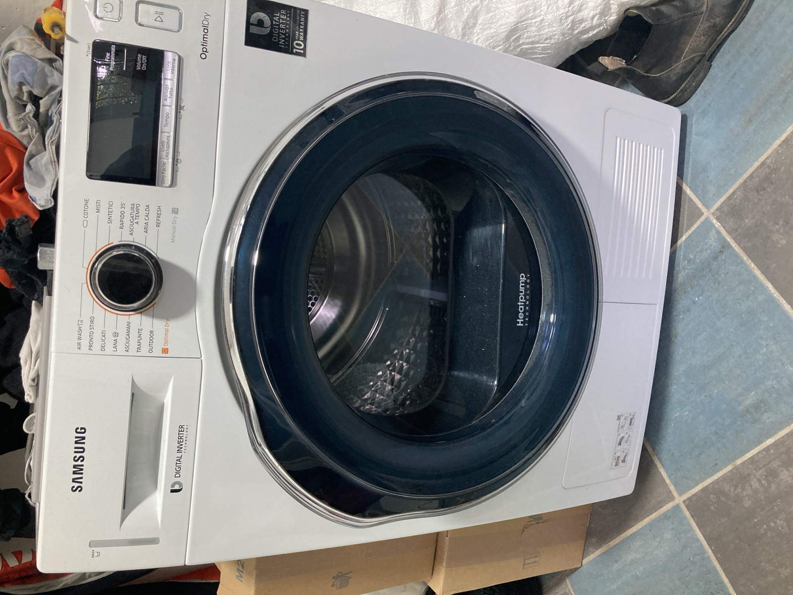
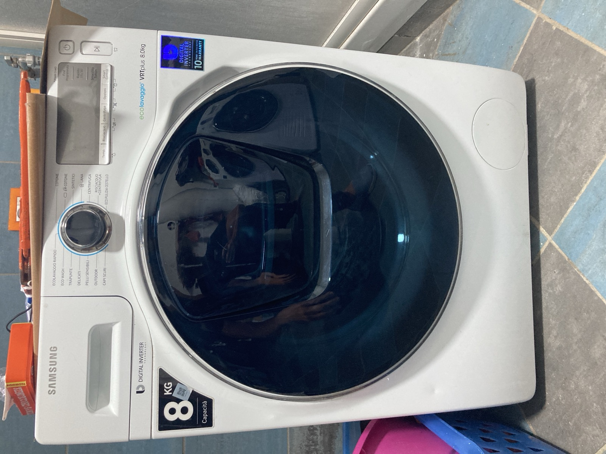
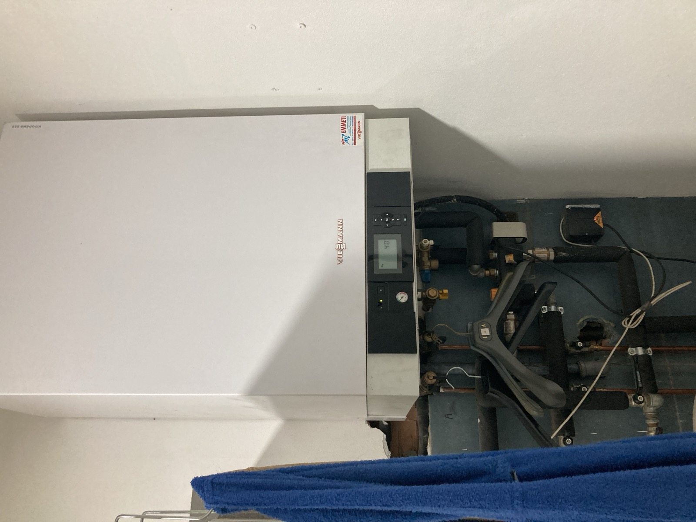
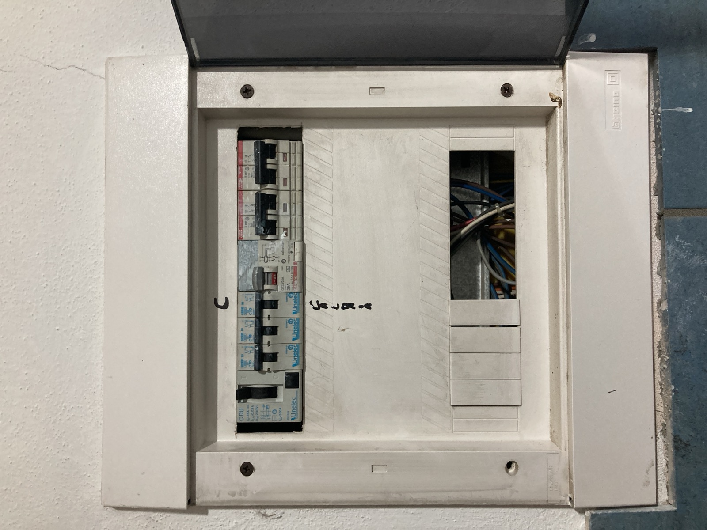

The laundry is on the **garage level**, reached from the garage itself. There's a
**washing machine**, a **dryer**, a **toilet** and a **shower**.

## The dryer — the filter

The dryer has **two filters** and they're handled differently:

- the **inner filter** must be cleaned **every 2-3 uses**. This one is on you to
  remember, the machine doesn't warn you;
- the **other filter** — **the machine tells you** when it's time.

## The washing machine — the filter

Simpler: **the machine tells you** when the filter needs cleaning.

