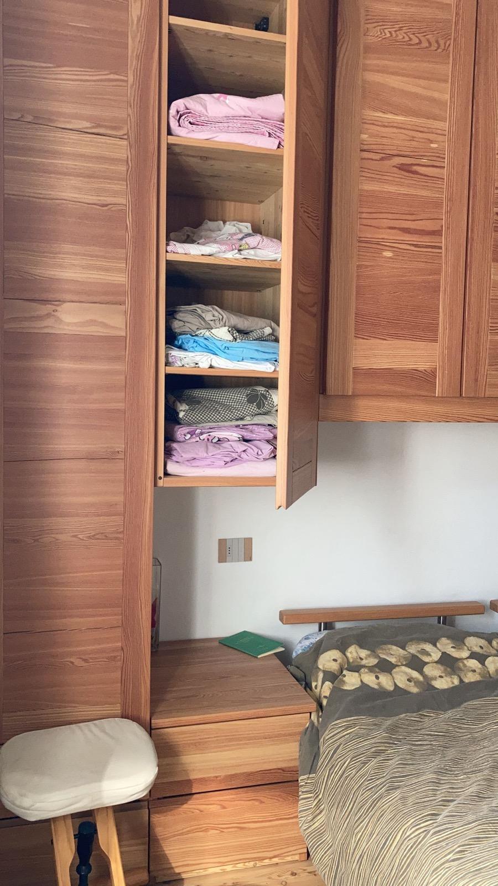
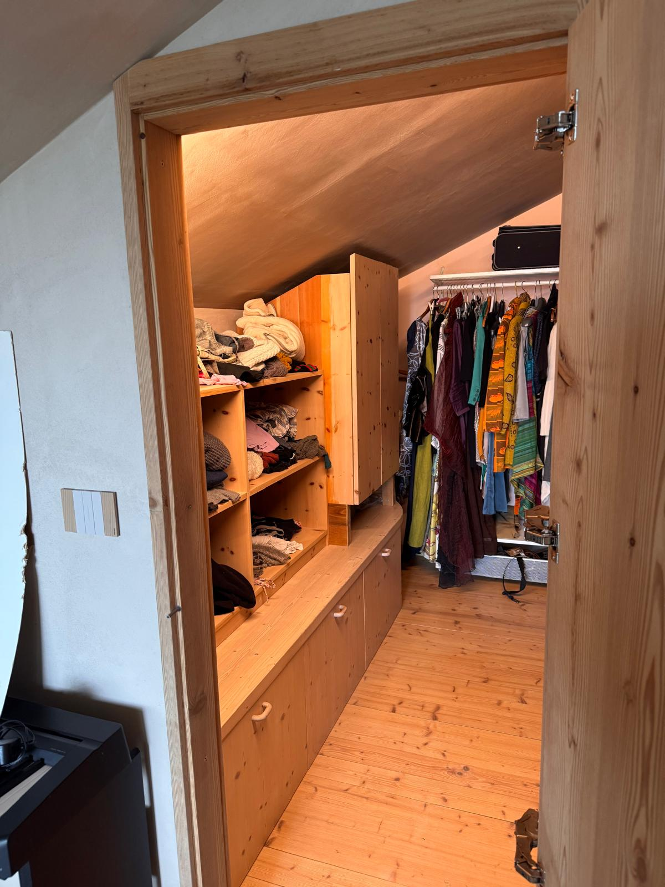

## Dove sono le lenzuola

La biancheria da letto è in **due punti**: nella camera al **secondo piano** e nella
**camera matrimoniale in mansarda**.

## La camera degli ospiti

C'è una **camera per gli ospiti**. Se siete più di quanti i letti fissi permettano,
ci sono **materassi** da tirare fuori — nel video qui sotto si vede dove stanno e
come si prendono.

<video src="../assets/materassi-ospiti.mp4" controls playsinline></video>

C'è anche una **seconda camera con cucina e divano letto** al piano del garage:
la trovate descritta nella sezione **Il garage**.
