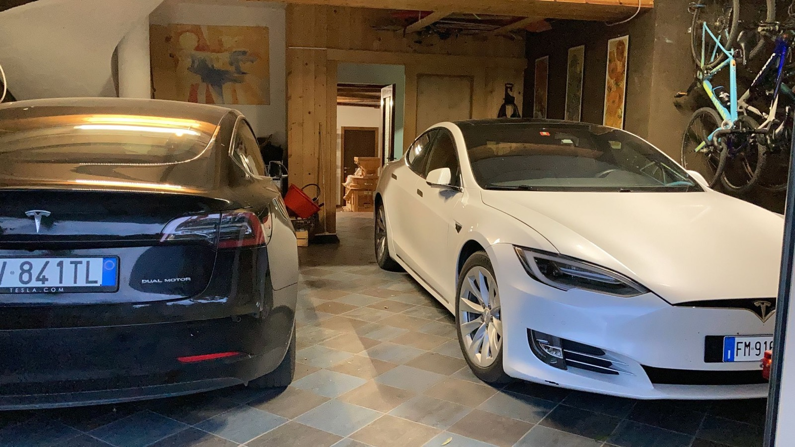
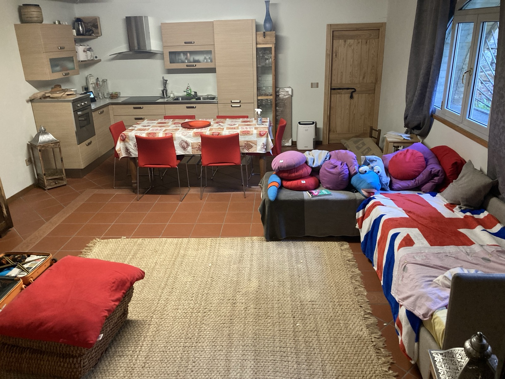

The garage holds **two cars plus the bikes**. One of our cars is almost always there,
so there's **one space** for you.

## The bikes — use them

There are **three gravel bikes**, a **carbon mountain bike** and an **electric city
bike**. Help yourselves.

The **locks** are **near the windows** or in the **grey cabinet on your right** as you
walk towards the bikes.

## What's beyond the garage

From the garage you reach three things:

- a **guest room with a kitchen and a sofa bed**; from there you go down to the **cellar**;
- the **laundry** (washer, dryer, toilet, shower);
- the **house**, by the internal staircase.

