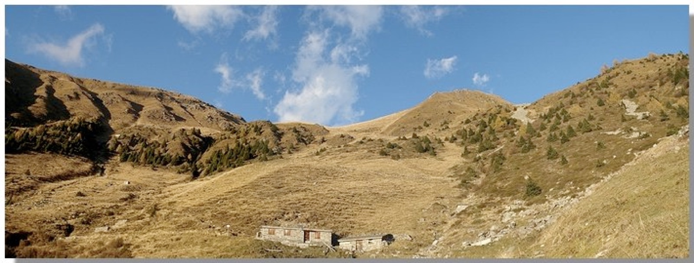
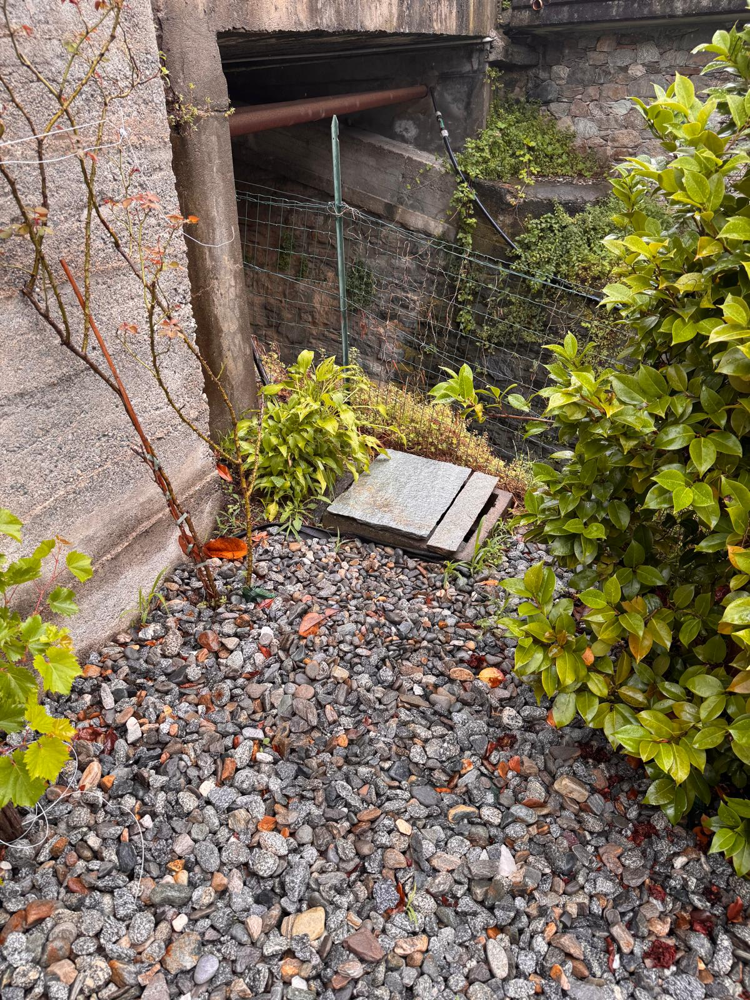
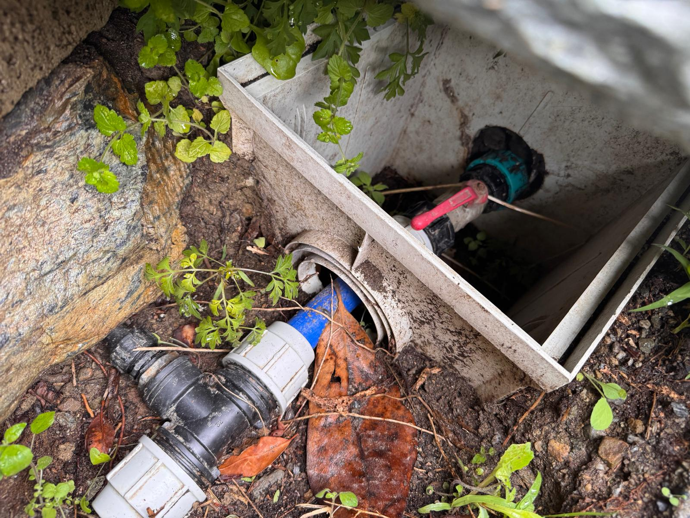

## Indoors, it's drinkable

The water in the house is **drinkable**, and comes from a **spring at the top of the
mountain** above us. Drink it from the tap without a second thought.

For faults or problems on the network: **Secam, 800 604 905**.

## In the garden, it isn't

In the garden there are **two taps**: that water is **not drinkable**. It's for the
**fish**, the **flowers**, the **trees** and the vegetable patch. Don't drink or cook
with it.

## If it needs shutting off

The **non-drinkable** water line is shut off here:

Normally there's no reason to touch it. It's written here for an emergency — a leak,
a burst pipe — so you know where to put your hands without hunting for it.
