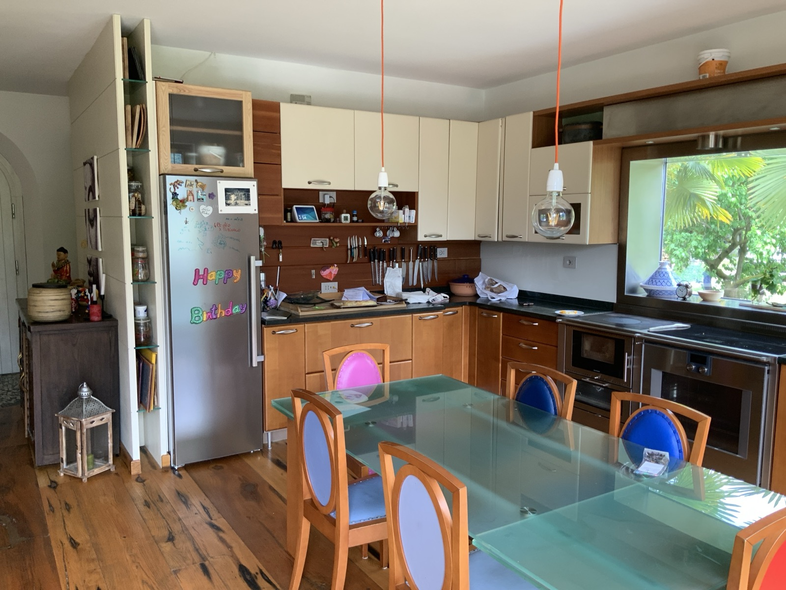
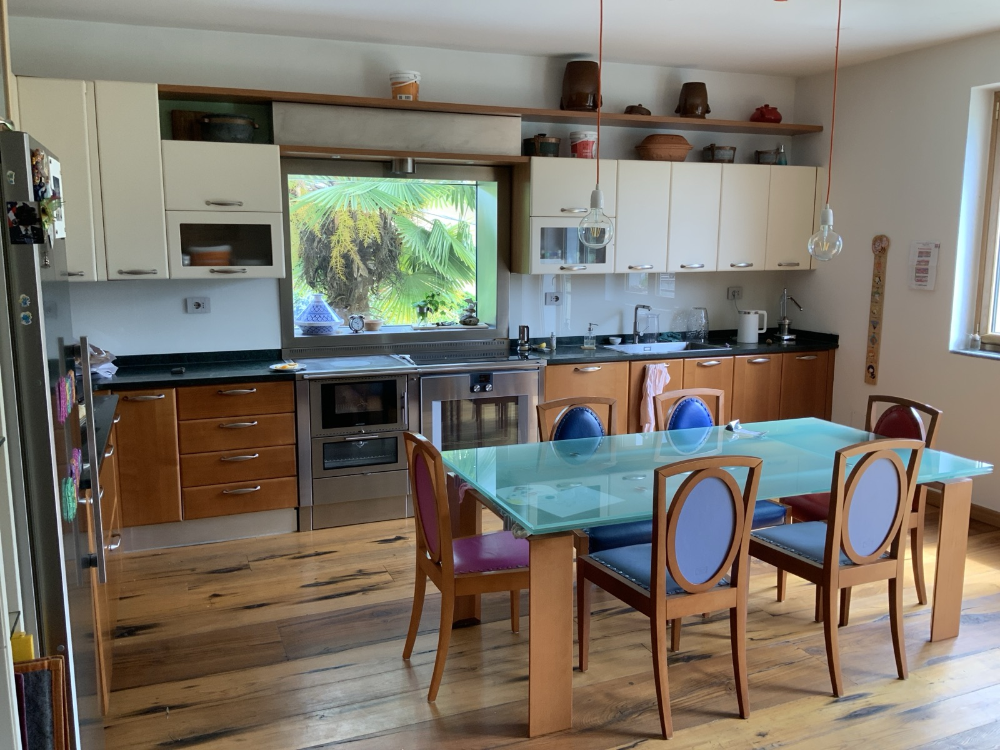

It's the room where we spend the most time: kitchen and dining room together, large on
purpose. Lucia cooks a lot, and this room was designed around that pleasure.

Use anything you need. The things that ask for a little more care — the knives and
certain pots — have their own section, **Taking care of things**.

## The induction hob

The hob is **induction**. Some of the pots in the house **are not suitable**: if one
doesn't heat, it isn't broken, it simply isn't ferromagnetic. Try another one and move on.

## One thing that doesn't work

The **tajine near the window is broken**. It's there for looks: don't put food in it.

