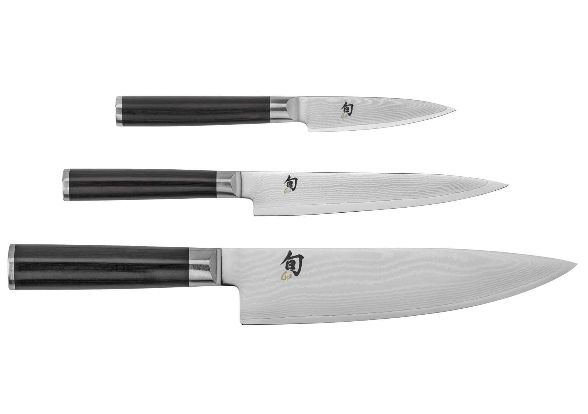
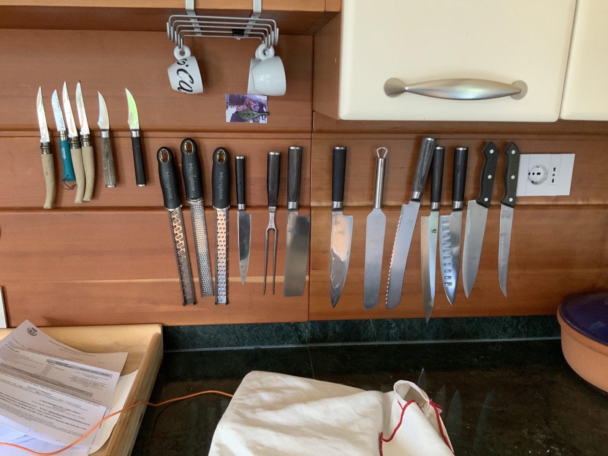
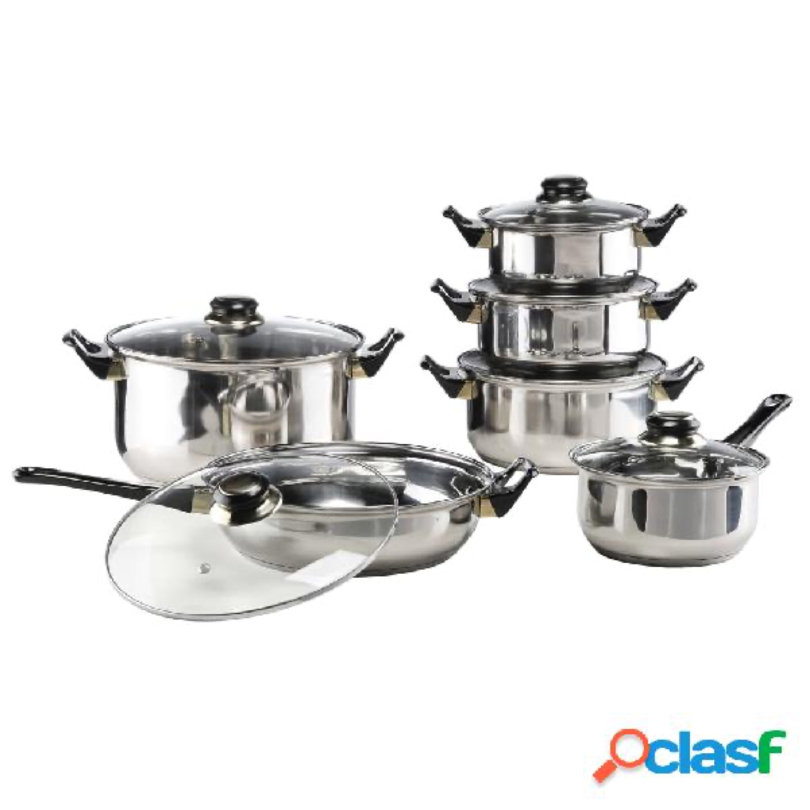

Due cose in cucina chiedono un gesto in più. Nient'altro.

## I coltelli Kay — a mano, non in lavastoviglie

I coltelli appesi alla **barra magnetica** sono **Kay knives**: il manico è in
**legno pregiato**. Vanno **lavati a mano**. La lavastoviglie, col calore e i detersivi,
rovina il legno in poche volte.

## Le pentole

Alcune pentole **non vanno sull'induzione**. Non c'è un modo elegante per riconoscerle
a occhio: provatele, e se una non scalda passate alla successiva. Non si rompe niente.

Abbiamo anche dei **lavec**, le pentole in **pietra ollare** della Valmalenco. Sono
oggetti locali, antichi come tecnica: se ve la sentite, cucinateci — ma trattateli con
calma, la pietra non ama gli sbalzi di temperatura.
