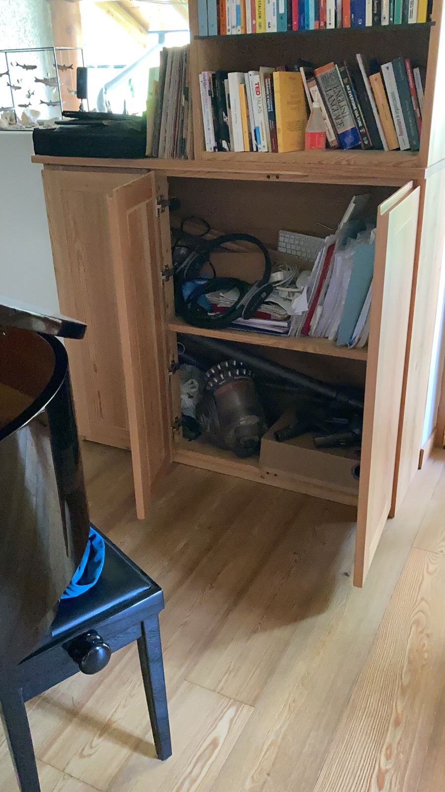
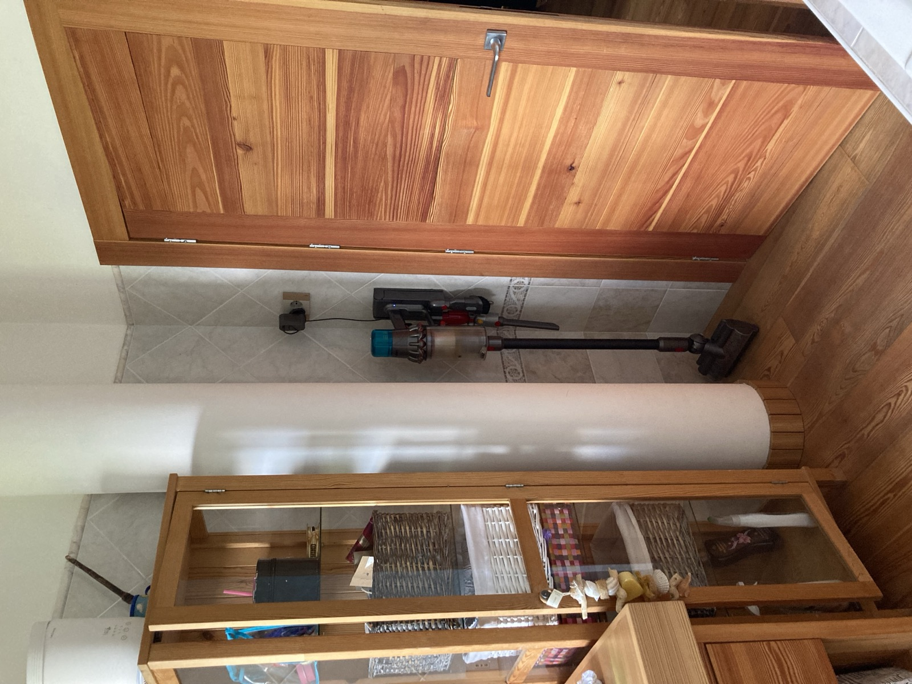
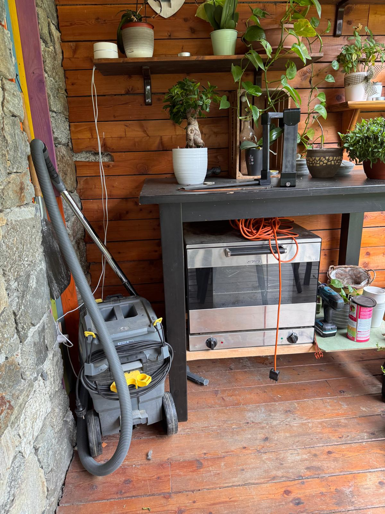

Ci sono **tre aspirapolvere**, uno per zona. Non è eccesso: la casa ha tre livelli e
portarne uno su e giù per le scale è una noia.

## Secondo piano — l'armadio vicino al piano

Un **Dyson**, nell'**armadio vicino al pianoforte**.

## Secondo piano — il bagno

Un altro, **nel bagno**, sempre al secondo piano.

## Piano terra — anche per fuori

Al **piano terra** ce n'è un terzo, adatto **anche agli spazi esterni**: è quello da
usare per il deck, il garage e tutto ciò che porta dentro terra e foglie.

