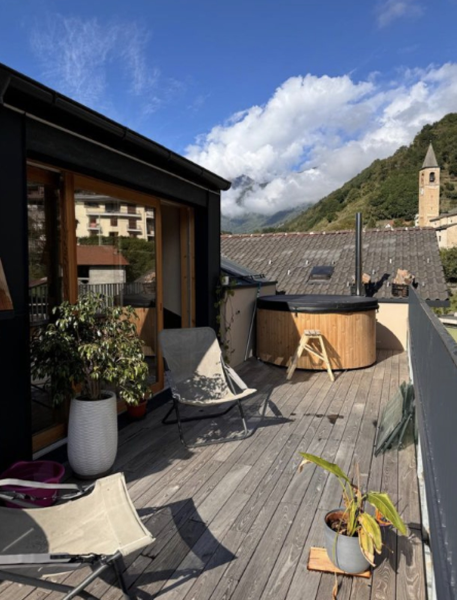
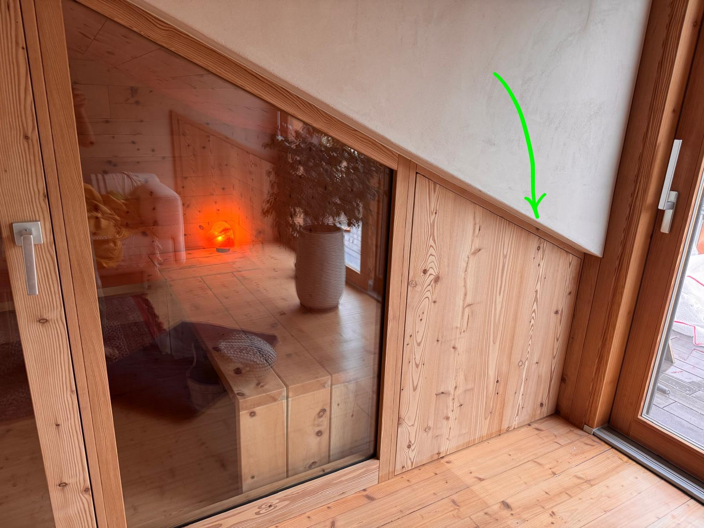
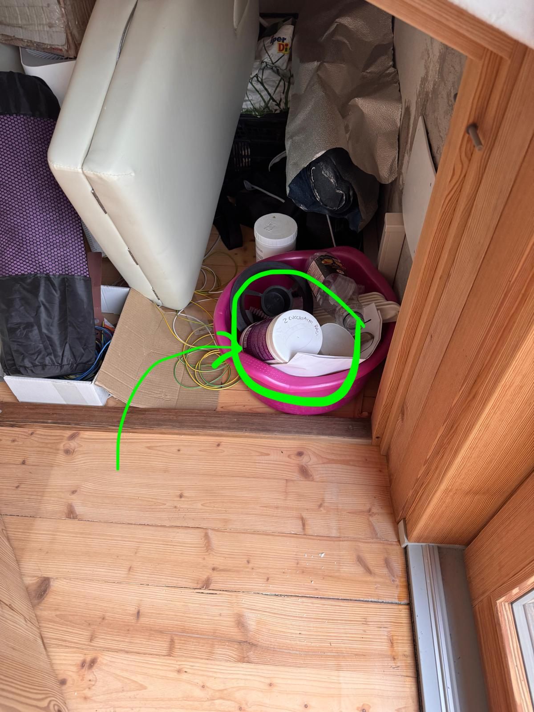

On the **rooftop terrace** there's the wooden, **wood-fired** tub. You use it **hot or
cold**, and at sunset — with the bell tower over there and the valley below — it's the
best spot in the house.

## Two people at a time

**The tub is for two people at a time.** It isn't a matter of space: it's the **wooden
deck** underneath, which must not be overloaded. Please respect this.

## To heat it

Two ways.

1. **With wood** — light the fire in the outdoor stove. The wood is in the **same cupboard
   as the chlorine**, below.
2. **Remotely** — if you prefer, **message Francesco** and he'll switch it on from afar.
   It's the easiest way: you'll find it already warm when you come up.

## The cupboard

It's the wooden door under the sloping ceiling, in the rooftop room — the one the arrow
points to.

Inside you'll find the **wood** and the **chlorine**, with its measuring cup.

## Upkeep, if you're staying

If you're here more than a few days, the water needs:

- **half a chlorine tablet once a week**, in its basket;
- **two level measuring cups every two days** — **every day** if the weather is very warm.
