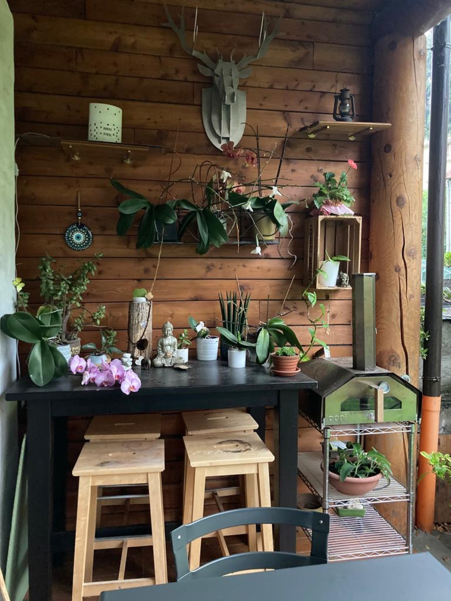
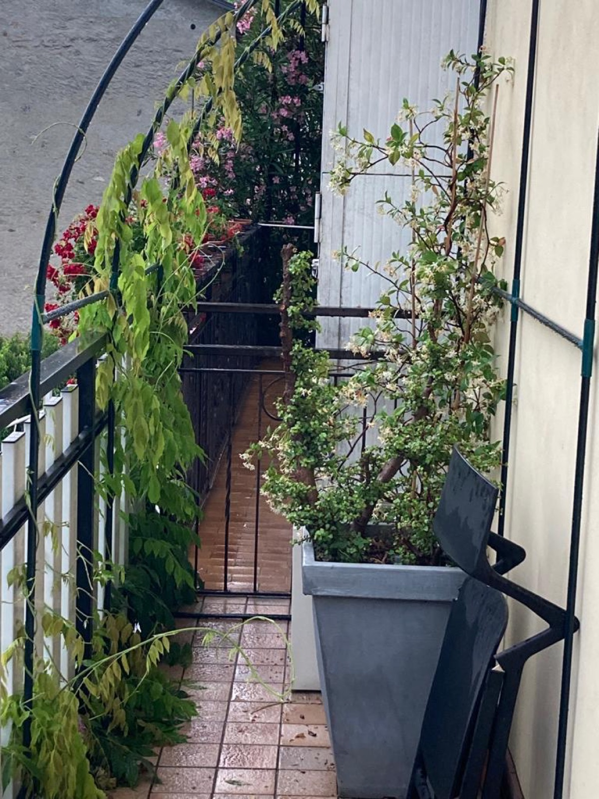

The garden is part of the house, not a side dish. There's a **vegetable patch** and there
are **fruit trees**: **pick and eat** freely, that's what they're there for.

## The orchids

The orchids want **a small glass of water once a week**. Not much, but regular.

## The other plants

Some plants drink more often. **Each pot has its own label** with instructions: follow
that, there's nothing to remember.

## The right water

For watering, use the **two garden taps** — the non-drinkable ones. That's exactly what
they exist for.
