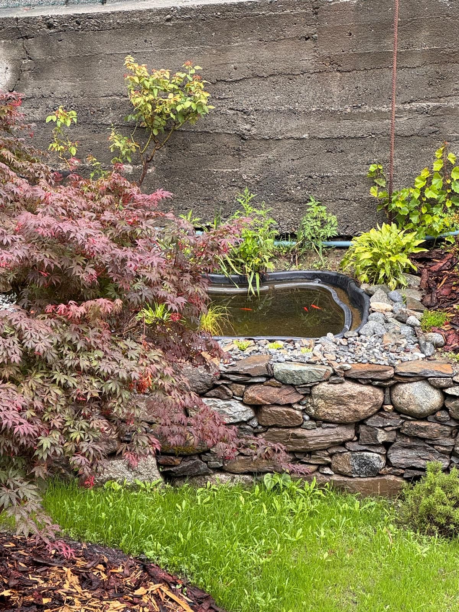

## I pesci rossi

C'è una **vasca con i pesci rossi**. **Non serve dar loro da mangiare.** L'unica cosa:
ogni tanto **controllate lo scarico della vasca**, che l'acqua riesca a defluire. Se si
intasa, l'acqua ristagna.

## Paola, Ciaparat, Shanti e Maya

Sono le nostre **quattro gatte**. Vivono tutte **dentro e fuori**, come preferiscono, e
valgono per tutte le stesse poche regole.

- **Date loro da mangiare quando ne hanno bisogno**, almeno **due volte al giorno**.
  Dentro o fuori casa, come vi è comodo.
- **Se uscite e la casa resta vuota, lasciatele fuori.**
- **Di notte possono tranquillamente stare fuori.** È la loro normalità, non un abbandono.

Non preoccupatevi se non le vedete tutte insieme: vanno e vengono per conto loro, e non
è raro che una sparisca per mezza giornata.
