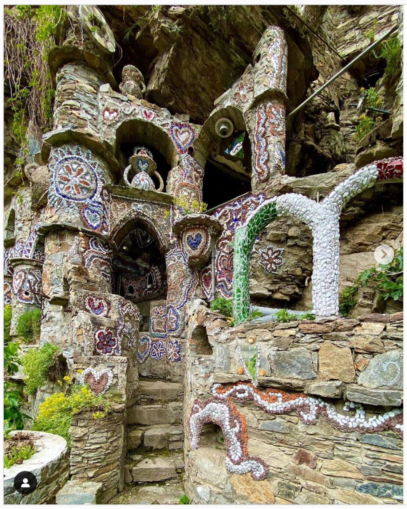

## A due passi

- **Il fiume Masino** ad Ardenno, **10 minuti in bici**. È il posto dove d'estate si
  rinfresca tutto il paese. Quattro punti: **la cascata** (la più adrenalinica, piena di
  ragazzi), **le pozze** (acqua più calda, ottima con bambini piccoli), **il chiosco**
  (panini e picnic, a 400 m dal fiume) e **gli scivoli** (poco frequentato, bellissimo).
- **Sentiero dei Terrazzamenti** — parte praticamente da casa.
- **Piramidi di Postalesio** — 15 minuti in auto, 50 in bici. La nostra piccola
  Cappadocia, senza mongolfiere.

## In bici

- **Giro corto**, 40 minuti: fino a **Monastero** e ritorno, passando accanto a un
  **castagno secolare**.
- **Sentiero Valtellina** fino a **Sondrio**, due ore andata e ritorno, con gelato.
- **Colico e il lago**: si prende il Sentiero Valtellina e si va sempre dritti. Quattro
  ore tra andata e ritorno, piacevolissime.

## Escursioni

- **Ponte nel Cielo**, Val Tartano — 30 minuti in auto. Ponte tibetano; l'**anello dei
  ponti** dura circa 4 ore.
- **Val di Mello** — 30 minuti. Granito e prati, camminata facile, e si nuota al
  **Bidet della Contessa**. Auto a San Martino, poi a piedi.
- **Lago Palù** — da San Giuseppe / I Barchi. Molto facile; d'inverno ottimo con lo slittino.
- **Laghetti di Campagneda e Alpe Prabello** — un'ora d'auto, due ore di cammino. Si
  mangia al rifugio, si nuota nei laghi, e si è sul confine svizzero: non spaventatevi
  se il telefono dà il benvenuto in Svizzera.
- **Rifugio Marinelli** — un'ora d'auto e 2,5 ore di cammino, da fare presto la mattina.
  Si vedono Bernina e Roseg.
- **Sentiero glaciologico del Ventina** — il ghiacciaio e i segni del suo ritiro. Bello
  e malinconico insieme.
- **Tour dei Quattro Laghi**, Valgerola — d'estate. Auto a Pescegallo, 40 minuti.
- **Pizzo della Rosetta** — dal Bar Bianco, anello di 2,5 ore. È una cima vera ma facile:
  buona per chi comincia.

## Sport

- **Rafting** con **Indomita** a Castione, 7 minuti da casa. Circa 4 ore.
- **Windsurf** sul **lago di Como**, da **Soul Surfer**: Luisa fa lezione volentieri.
- **Cavallo**: **Isola del Cavallo**, 20 minuti — Raimondo, +39 392 329 5853. Per lezioni
  private, **Sergio Abram**, +39 333 341 9758 (parla francese e inglese).
- **Boulder**: nella camera dei genitori c'è un **materassino Domino Cassin**, portatelo
  in **Valmasino**. Servono le scarpette — se calzate 40 o 44 chiedete a noi. Nella
  camera di Anna, al primo piano, ci sono molti libri sull'arrampicata.

## Musei e paesi

- **Miniera della Bagnada** — 40 minuti. Una vecchia miniera di talco, si cammina nei
  cunicoli. Anche d'estate: portate una giacca a vento.
- **Chiavenna** — centro storico, biscotti di Piuro, **violino di capra** (presidio Slow
  Food). Vicino, le cascate dell'**Acquafraggia** e **Palazzo Vertemate** (su prenotazione).
- **Incisioni rupestri di Grosio** — ingresso libero. Lì accanto il **giardino di Nicola
  di Cesare**, il "Gaudí" locale.

## Per il corpo

- **Massaggio ayurvedico** a 15 minuti **a piedi** da casa: **Silvia**, +39 346 308 5777.
- **Bagni Vecchi / Terme di Bormio** — terme di origine romana.
