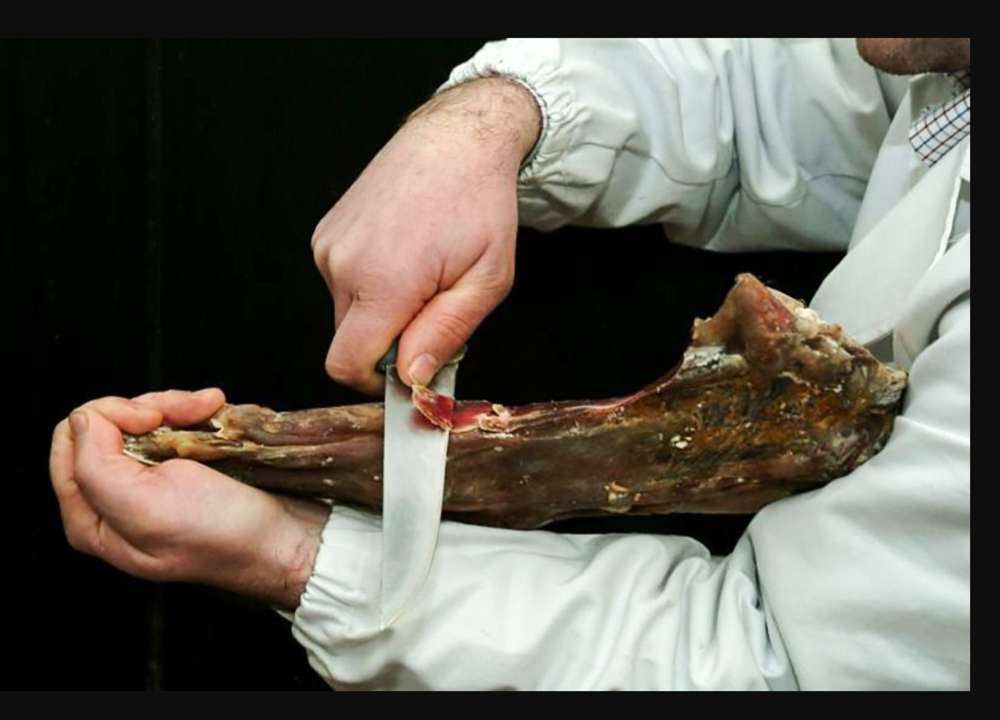

## Da mangiare

- **Pizzoccheri** — tagliatelle di grano saraceno con verza, patate e formaggio fuso.
- **Polenta** — in molte versioni e con molti accompagnamenti.
- **Taroz** — fagiolini e patate schiacciati, con burro, pancetta e formaggio.
- **Bisciola** — dolce di farina di segale, fichi secchi, castagne, noci e burro.
- **Cupeta** — dolce di noci e miele.
- **Violino di capra** — presidio Slow Food, si trova a Chiavenna. Si taglia tenendolo
  come un violino: da lì il nome.

- **Bitto storico** — in Valgerola c'è una casera. Per visitarla o decorare la vostra
  forma, chiamate **Carlo**, +39 335 161 9279, dicendo che siete a casa nostra.
- **Ricotta e burro d'alpe** de **La Taida**, a 2 km da casa. D'estate portano le vacche
  in alpeggio: si va in auto a Tartano, si lascia vicino all'**Albergo Vallunga** e si
  sale a piedi verso l'**Alpe Sona**.

## Da indossare

- **Pedui** — le pantofole di Valmalenco.

## Per la tavola e la cucina

- **Pezzotti** — i tappeti tessuti a mano.
- **Lavec** — le pentole in pietra ollare della Valmalenco. Ne abbiamo alcune in casa.
