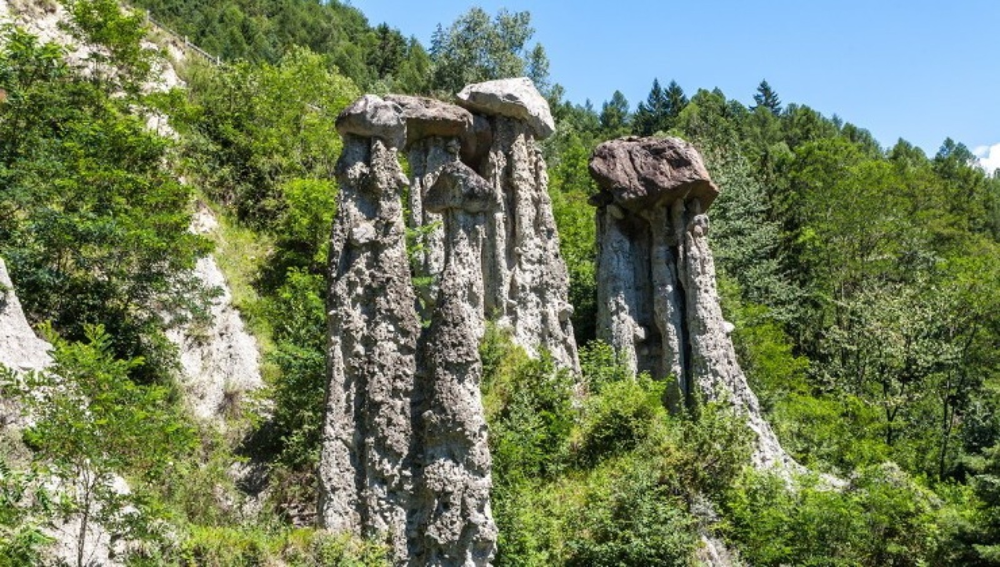

## Dormite in Europa, guardate l'Africa

Dalla finestra, guardando a **sud**, vedete una montagna che geologicamente **non è
europea**. Davanti a casa passa la **linea Insubrica** (o Periadriatica), la sutura tra la
placca europea e quella adriatica-africana. Qui c'è chi **dorme in Europa e pranza in
Africa**.

## Shakespeare, forse

Si racconta che **William Shakespeare** sia stato concepito a **Tresivio**, nella casa
dell'Otello. Oggi lì c'è il **Jom Bar**.

## Gli UFO della Valmalenco

In **Valmalenco**, dicono, si vedono **UFO** — se siete fortunati. Ci sono anche belle
gite, comunque vada.

## Le marmotte pigre

A **Chiareggio** ci sono **marmotte domestiche** e piuttosto pigre.

## Il Gaudí di Grosio

**Nicola di Cesare** vive a **Grosio** e da oltre trent'anni costruisce il suo giardino
in stile Gaudí. Ingresso libero.

